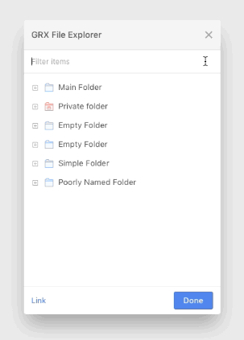

# Exercise: Build an Explorer

## Exercise Findings
> Andy's thoughts and notes

### Choices & Techniques
- Using **Sass** to pre-process CSS, use variables, etc.—it's what I'm most familiar with and it's easy to manage alongside React components.
- Added an `id` field to each item upon initial processing:
    - makes state changes far easier
    - eliminates duplicates (object === object)
    - allows us to key off of `id` when we map and render each item
- Also added initial `selected` and `expanded` states to each item so React is aware of them, and so each are included when **exporting** the file tree.
- Created a generic `<Tree>` component with `<TreeItem>`s that use `<Tree>` internally in order to recurse the children.
- Double click a folder to expand/collapse, or use the expander icon.

#### Other potential routes
I considered normalizing / flattening the file data to make state updates and additions easier. Managing a flat hash table is much easier than nested structures.

Using `id` and `parentId` for relationships would allow us to reconstruct the nested structure that allows React to render it recursively, and open opportunities to sort and filter our data in any way we like.

With React's more recent updates (Fiber), passing a newly transformed nested structure would allow it to re-render only what was changed, assuming the `ids` haven't changed since we're using them as **keys**.

### Architecting for the advanced features

In `App.js`, I am using a combination of `useImmer` and React Context to safely mutate the deeply nested file data structure.

This allows us to:

1. **Export the full state** of the file data tree into localStorage or by other means, preserving the **selected** (singular) and **expanded** (multiple) states on the tree.

2. Make **importing** relatively simple by retrieving our modified file data tree and passing it to `useImmer`'s initial state at the beginning, or using `updateFileData()` in `App.js` to assign a fresh file tree.

3. **Adding** files/folders will take a bit more logic, but we can write additional handlers in `App.js` (or by passing `updateFileData` down via Context) to mutate our deeply nested data (`fileData`) safely, with with very little frustration.

4. **Moving** files/folders would be similar to adding—it's a matter of writing the handlers to leverage `updateFileData` by moving an item to a different `children` collection and deleting the old item.

Note: additions or moves are still exportable (#1) since we're only changing `fileData`.

(Read more on the excellent [Immer](https://immerjs.github.io/immer/docs/introduction) and [useImmer hook](https://github.com/immerjs/use-immer))

### Additions (for a fun challenge)

#### Filtering & Sorting of Files and Folders

I wasn't sure what the **Label** field was meant for in the mockup, so I thought it'd be a fun challenge to let this be an input to filter items by name, using a fuzzy string search to match names loosely.

Results are displayed in a flat list (maintaining expand/collapse and all interactivity) and are scored 0 to 1 and sorted by highest scored matches. Matches below the 0.5 threshold are not displayed.

- **Clear** or press Esc to reset the field
- An empty string resets `fileData` to a fresh file data tree

---

# Exercise Details

This exercise is to build a folder and file explorer (or a tree control). You must use ReactJS for this project. We recommend using https://github.com/facebookincubator/create-react-app to bootstrap your project, but you can set it up however you'd like.

Please do not use an off-the-shelf tree control packages or any CSS frameworks (like Bootstrap or Foundation) since that would
defeat the purpose of this project!

## Requirements

### Application

- Use create-react-app to create a react app that renders the interactive file explorer shown in `mockup.png`
- Use the data from `data.json` to render the actual folders & files. You can make the data in `data.json` a global variable so that you don't need to load it with AJAX.
- We will run your code by opening your project, running `npm install` and `npm start`, and viewing the result at localhost:3000

#### Appearance

- What you build should look like a modal but doesn't need to function like one. (i.e. opening/closing and dragging it around are not necessary)
- Visually has appearance similar to that of `mockup.png` (private folders should have the red icon appearance)

### Minimum Features

- Folders should be able to expand or collapse by clicking on the expand/collapse icon.
- Folders and files should have a hover appearance (such as highlighting the row blue).

### Advanced Features (Do Not Code These!)

Below are advanced features. Please do not implement these, but **architect your minimum features with the advanced features in mind**. In later interviews,
you may be asked exactly how you would implement these into your app.

- Add a button "Export". This should export the exact state & configuration of your app - the folders & files structure,
  which ones are expanded/collapsed, which one is selected. You should decide what you want the exported configuration file to hold.
- Add a button "Import". This should allow the user to import data that you exported from the above feature and
  re-render the explorer to the state specified in the imported file.
- Add a button "Add". This should allow the user to add a new file or folder to the location that is currently selected.
- Add the ability to move a file or folder by dragging it to another location.

## Evaluation Criteria

1. Minimum features completed
2. DRY, reusable, well-thought-out code that lays good infrastructure for implementing all of the Advanced Features
3. Simplicity of overall solution
4. Clean CSS rendering of `mockup.png` in latest Chrome